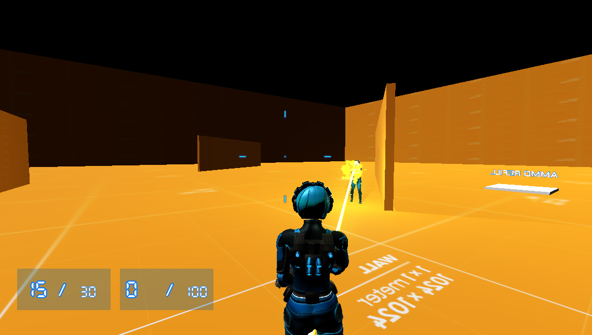

# Godot Kotlin/JVM Third Person Experiment

A technical exploration of 3D game mechanics in **Godot 4.x** using the **Kotlin/JVM** binding. This project adapts and refactors traditional GDScript-based third-person controllers into a Java/Kotlin-compatible architecture.

## 🎮 Play the Game
A prebuilt binary is available on **itch.io**: [third-person-shooter-godot-jvm](https://danil-ko.itch.io/third-person-shooter-godot-jvm)

## 📺 Gameplay Video
Watch the gameplay demo on **YouTube**: [third-person-shooter-godot-jvm](https://youtu.be/CiJGKLYyk9Q)

## 🛠 Tech Stack
* **Engine:** Godot 4.6 (Custom [Utopia-Rise](https://github.com/utopia-rise/godot-kotlin-jvm) build required)
* **Plugin:** godot-kotlin-jvm `0.15.0-4.6`
* **Language:** Java / Kotlin
* **JDK:** 17 (configured via Gradle JVM toolchain)

## ✨ Features & Modifications
This project is based on Johnny Rouddro's Third Person Controller tutorial ([YouTube](https://www.youtube.com/watch?v=3AD2z2mx3sY)) but introduces several architectural changes and gameplay tweaks:

* **Input-Driven Character Architecture:** `Character` (base) → `Player` / `Enemy`. All state transitions go through a `CharacterInput` snapshot, making human input, AI, and future network input interchangeable.
* **Movement Mechanics:**
    * Added **Double Jump** capability.
    * **Crawl-to-Shoot** mechanics (Experimental/Beta animation).
    * Dynamic **Physics Body transformation** during dodge rolls.
* **Combat & Ballistics:**
    * Bloom spread system: per-shot accumulation, movement penalty, stance multipliers, camera recoil.
    * Dynamic crosshair that tracks the live spread value from `WeaponController`.
    * Toggleable over-the-shoulder camera (Left/Right swap).
* **Enemy AI (5-state FSM):**
    * CS 1.6-inspired accuracy: configurable hit chance, reaction delay, aim scatter, and suppression fire.
    * Navigation via `NavigationAgent3D`; separate SightRay (LoS) and AimRay (fire direction).
    * Ammo management with a dedicated `RefillAmmoState`.
* **Game Systems:**
    * `EventBus` AutoLoad singleton for decoupled kill/death events.
    * `GameManager` AutoLoad singleton (PLAYING / PAUSED / GAME_OVER).
    * `AmmoRefill` environment trigger that replenishes all weapons on contact.

---

## 🏗 Architecture

### Character Input Pattern

```
Character._physicsProcess()
    │
    ├── gatherInput(delta) → CharacterInput   ← overridden per subclass
    │       Player   : polls Input singleton (keyboard/mouse)
    │       Enemy    : AI FSM writes decisions into struct fields
    │       (Network): future — inject a deserialized snapshot here
    │
    └── applyInput(input, delta)              ← shared in base class
            all signal emissions and state transitions live here
```

`CharacterInput` carries a monotonically-increasing `tick` counter so inputs are totally ordered and can be replayed for client-side prediction in the future.

### Scene Inheritance

```
CharacterBody3D (Character.tscn)   ← shared ragdoll, health, weapon controller
    ├── Player.tscn                 ← HUD wiring, keyboard/mouse input
    └── Enemy.tscn                  ← AI FSM, NavigationAgent3D, SightRay
```

---

## 🤖 Enemy AI

The enemy uses a **5-state singleton FSM**. States are stateless objects; all mutable data (timers, last-known position) lives on the `Enemy` node.

| State | Description |
|:------|:------------|
| **PatrolState** | Wanders within `patrolRadius` of spawn using NavAgent. Transitions to Chase/Attack on sight, Search on hit. |
| **ChaseState** | Sprints toward the player. Navigates to last known position when LoS is broken. Falls back to Patrol after `LOST_PLAYER_TIMEOUT`. |
| **AttackState** | Strafes laterally, waits for `reactionTime`, then fires per-shot accuracy rolls. Fires suppression shots at last known position for up to `suppressionDuration` after losing LoS. |
| **SearchState** | Moves to last known position and strafes to peek cover. Re-engages on sight; gives up after 5 s and returns to Patrol. |
| **RefillAmmoState** | Sprints to the `ammoRefill` Area3D. Fills all weapons on arrival, then returns to Patrol. |

### State Transitions

```
Patrol ──(sees player, in range)──► Attack ──(out of range)──► Chase
       ──(sees player, out of range)► Chase  ──(in range + LoS)► Attack
       ──(hit without LoS)─────────► Search  ──(sees player)──► Attack/Chase
                                             ──(timeout 5 s)──► Patrol
Attack ──(no ammo)─────────────────► RefillAmmo ──────────────► Patrol
```

### Accuracy Knobs

| Property | Default | Description |
|:---------|:-------:|:------------|
| `hitChance` | 0.9 | Per-shot probability of actually hitting (0 = always miss, 1 = always hit) |
| `reactionTime` | 0.1 s | Seconds from first LoS contact before firing starts |
| `aimScatterRadius` | 1.5 | Max scatter radius (world units) at 10 m; scales linearly with distance |
| `suppressionDuration` | 1.5 s | How long the enemy fires blind after losing LoS |
| `strafeChangeDuration` | 1.0 s | Seconds between lateral strafe direction changes |
| `detectionRange` | 120 | Max range for LoS detection |
| `attackRange` | 150 | Max range to stay in AttackState |

LoS is detected via a dedicated **SightRay** that is completely independent of the AimRay. This means accurate LoS detection never implies accurate aim — the two systems are decoupled.

---

## 🎯 Combat System

### Weapon Ballistics (Spread & Bloom)

`WeaponController` computes a live spread value each frame:

```
totalSpreadDeg = (baseSpread + velocity × 0.12°/(m/s) + currentBloom) × stanceMultiplier
```

| Stance / Condition | Multiplier |
|:-------------------|:----------:|
| Upright (default) | 1.0× |
| Crouch | 0.7× |
| Crawl | 0.5× |
| Airborne | 2.0× |

The crosshair (`Crosshair.java`) reads this value from `WeaponController.getCurrentSpreadDeg()` each frame and lerps the reticle arms accordingly (fast expand on shot, slow contract during recovery).

Camera recoil is routed through `CameraController.applyRecoil()` so it accumulates and recovers independently of spread.

### Skeleton Hitbox & Damage Zones

Damage is resolved against the character's **physical ragdoll skeleton** (`PhysicalBoneSimulator3D`). Each `PhysicalBone3D` acts as an independent collider, so the hit location on the body determines the damage multiplier applied to the base weapon damage.

| Body Zone | Bones | Damage Multiplier |
|:----------|:------|:-----------------:|
| **Head / Neck** | `neck_01` | **4.0×** |
| **Upper Torso** | `spine_03`, `clavicle_l`, `clavicle_r` | 1.0× |
| **Mid / Lower Torso** | `spine_02`, `spine_01`, `pelvis` | 0.75× |
| **Arms** | `upperarm_l/r`, `lowerarm_l/r`, `hand_l/r` | 0.75× |
| **Legs** | `thigh_l/r`, `calf_l/r`, `foot_l/r` | 0.5× |

The hitbox colliders are the same bones that drive the ragdoll on death — no separate invisible hit-mesh is needed.

### Headshot Detection

A hit is classified as a **headshot** when the colliding bone is `Physical Bone neck_01`. This single bone covers both the neck capsule and the head sphere in the ragdoll setup.

```
hit bone == "Physical Bone neck_01"  →  headshot = true  →  4× damage
```

Headshot detection lives in `Health.takeDamage()` and is bone-name driven, so it works identically for both player and enemy characters.

### Kill Notifications (EventBus)

When any character's health reaches zero, `Health` emits a unified payload to the **EventBus** singleton:

```
EventBus.characterEliminated(attackerName, victimName, weaponName, headshot)
```

The player HUD (`CharacterHUD`) subscribes to this signal in `_ready()` and displays a 3-second notification:

| Situation | Example message |
|:----------|:----------------|
| Body shot kill | `Enemy Eliminated [Pistol] - Eliminated` |
| Headshot kill | `Enemy Eliminated [Pistol] - Headshot` |
| Player killed | `Player Eliminated [Rifle] - Eliminated` |

Character display names are configured via the `displayName` export property on each `Health` node. If left blank, the owning node's scene name is used as a fallback.

> **Note:** This is an experimental codebase. You may encounter "crunch-time" bugs or unstable animations. It is provided as-is for educational purposes.

---

## 🚀 Getting Started

### Prerequisites
You **cannot** use the standard Godot editor. You must download the specific Kotlin-JVM enabled editor from [Utopia-Rise Releases](https://github.com/utopia-rise/godot-kotlin-jvm).

### Build Instructions
1. Clone the repository.
2. Run the Gradle build task to generate the necessary JVM wrappers:
   ```bash
   ./gradlew build
   ```
3. Open the `project.godot` file using the **Godot Kotlin/JVM Editor**.

---

## 🎮 Controls

| Action                   | Input                        |
|:-------------------------|:-----------------------------|
| **Move**                 | `W` `A` `S` `D`              |
| **Jump / Double Jump**   | `Space`                      |
| **Roll**                 | `Ctrl` + Direction           |
| **Crouch / Crawl**       | `C` / `V`                    |
| **Aim / Fire**           | `Mouse Right` / `Mouse Left` |
| **Reload**               | `R`                          |
| **Switch Weapon**        | `G`                          |
| **Swap Camera Shoulder** | `Q`                          |
| **Menu**                 | `Esc`                        |

---

## 📚 Credits & Assets

### Code & Logic
* Base Third Person Controller by **Johnny Rouddro**: [YouTube](https://www.youtube.com/watch?v=3AD2z2mx3sY) | [GitHub](https://github.com/JohnnyRouddro/Godot_Third_Person_Controller) | [Itch.io](https://johnnyrouddro.itch.io/godot-4-third-person-controller)

### Models & External Assets
* **Weapon Models:** [50 Low-poly Guns](https://quaternius.itch.io/50-lowpoly-guns) by Quaternius.
* **Additional Assets:** [Godot Asset Library](https://godotengine.org/asset-library/asset/781).


Note:
Did use Gemini/Claude AI during debugging/documentation.

---

## 🎮 Screenshots



