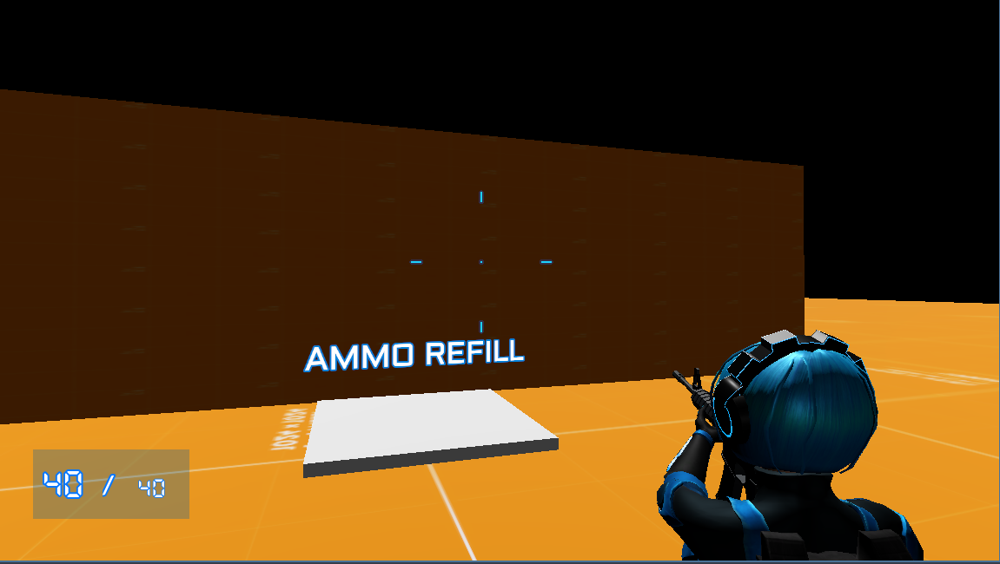
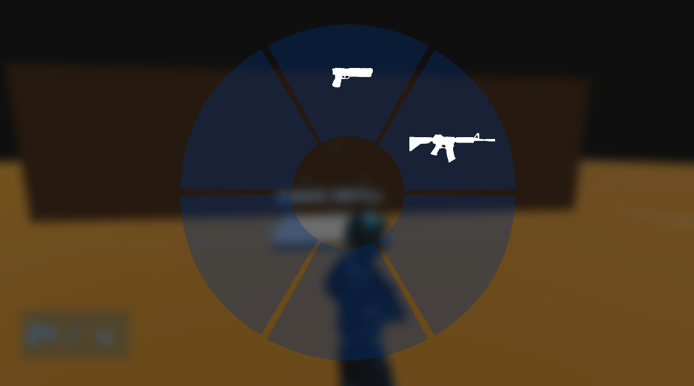

# Godot Kotlin/JVM Third Person Experiment

A technical exploration of 3D game mechanics in **Godot 4.x** using the **Kotlin/JVM** binding. This project adapts and refactors traditional GDScript-based third-person controllers into a Java/Kotlin-compatible architecture.

## 🛠 Tech Stack
* **Engine:** Godot 4.5.1 (Custom [Utopia-Rise](https://github.com/utopia-rise/godot-kotlin-jvm) build required)
* **Language:** Java / Kotlin
* **JDK:** Amazon Corretto 25

## ✨ Features & Modifications
This project is based on Johnny Rouddro's Third Person Controller tutorial ([YouTube](https://www.youtube.com/watch?v=3AD2z2mx3sY)) but introduces several architectural changes and gameplay tweaks:

* **Decoupled Architecture:** Refactored the monolithic player class into a modular **Controller** system.
* **Movement Mechanics:** * Added **Double Jump** capability.
    * **Crawl-to-Shoot** mechanics (Experimental/Beta animation).
    * Dynamic **Physics Body transformation** during dodge rolls.
* **Combat Updates:**
    * Simplified weapon system (Always equipped, no holster state).
    * Customized weapon models and swap logic.
    * Toggleable over-the-shoulder camera (Left/Right swap).

* **Sample State Based Enemy:**
  * Use Navigation 3D Agent for movement
  * Use basic state machine for state
  * Basic damage systems for player and enemy

> **Note:** This is an experimental codebase. You may encounter "crunch-time" bugs or unstable animations. It is provided as-is for educational purposes.

---

## 🚀 Getting Started

### Prerequisites
You **cannot** use the standard Godot editor. You must download the specific Kotlin-JVM enabled editor from [Utopia-Rise Releases](https://github.com/utopia-rise/godot-kotlin-jvm).

### Build Instructions
1. Clone the repository.
2. Run the Gradle build task to generate the necessary JVM wrappers:
   ```bash
   ./gradlew build
   ```
3. Open the `project.godot` file using the **Godot Kotlin/JVM Editor**.

---

## 🎮 Controls

| Action | Input |
| :--- | :--- |
| **Move** | `W` `A` `S` `D` |
| **Jump / Double Jump** | `Space` |
| **Roll** | `Ctrl` + Direction |
| **Crouch / Crawl** | `C` / `V` |
| **Aim / Fire** | `Mouse Right` / `Mouse Left` |
| **Reload** | `R` |
| **Switch Weapon** | `G` |
| **Swap Camera Shoulder** | `Q` |

---

## 📚 Credits & Assets

### Code & Logic
* Base Third Person Controller by **Johnny Rouddro**: [YouTube](https://www.youtube.com/watch?v=3AD2z2mx3sY) | [GitHub](https://github.com/JohnnyRouddro/Godot_Third_Person_Controller) | [Itch.io](https://johnnyrouddro.itch.io/godot-4-third-person-controller)

### Models & External Assets
* **Weapon Models:** [50 Low-poly Guns](https://quaternius.itch.io/50-lowpoly-guns) by Quaternius.
* **Additional Assets:** [Godot Asset Library](https://godotengine.org/asset-library/asset/781).


Note:
Did use Gemini/Claude AI during debugging/documentation.

---

## 🎮 Screenshots


