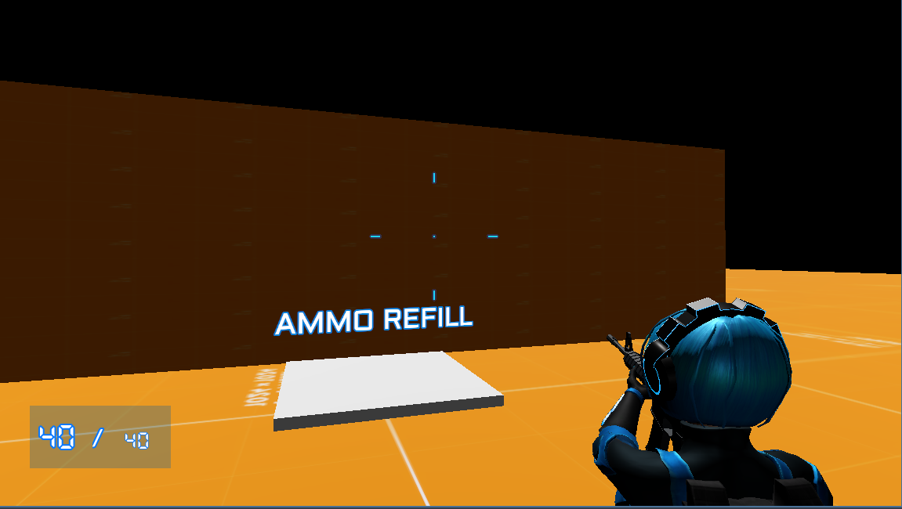
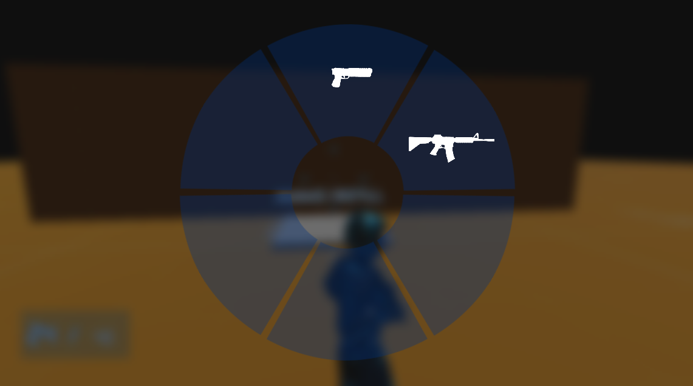
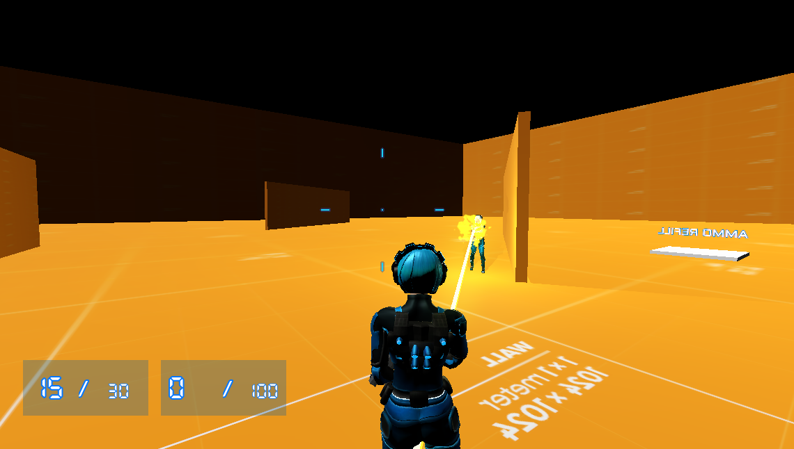

# Godot Kotlin/JVM Open World First/Third Person Network Multiplayer Shooter

A technical exploration of 3D game first/third person network multiplayer shooter mechanics in **Godot 4.x** using the **Kotlin/JVM** binding. 

## 🎮 Play the Game
A prebuilt binary is available on **itch.io**: [third-person-shooter-godot-jvm](https://danil-ko.itch.io/third-person-shooter-godot-jvm)

## 📺 Gameplay Video
Watch the gameplay demo on **YouTube**: [third-person-shooter-godot-jvm](https://youtu.be/CiJGKLYyk9Q)

## 🛠 Tech Stack
* **Engine:** Godot 4.6 (Custom [Utopia-Rise](https://github.com/utopia-rise/godot-kotlin-jvm) build required)
* **Plugin:** godot-kotlin-jvm `0.15.0-4.6`
* **Language:** Java / Kotlin
* **JDK:** 17 (configured via Gradle JVM toolchain)

## ✨ Features & Modifications
This project is based on:
 - Johnny Rouddro's Third Person Controller tutorial ([YouTube](https://www.youtube.com/watch?v=3AD2z2mx3sY)) with several architectural changes and gameplay tweaks.
 - octodemy's Custom Raycast Vehicle Physics in Godot ([YouTube](https://www.youtube.com/@octodemy)) with several architectural changes and gameplay tweaks.

* **Input-Driven Character Architecture:** `Character` (base) → `Player` / `AICharacter`. Each body delegates its "brain" to a `Controller` (`PlayerController` for keyboard/mouse, `AIController` for the FSM) via the `Controllable` interface. All state transitions go through a `UserCommand` snapshot, making human input, AI, and network input (`NetworkController`) interchangeable.
* **Movement Mechanics:**
	* **Run by default**; hold (or toggle) **Shift** to *walk* — slower and quieter ("walk to stay quiet"), scaffolding for a future stealth/awareness system (the WALK state carries a low `noiseLevel`).
	* Single **ground jump** plus CS/Source-style **air strafe** (mid-air acceleration / speed cap) — replicates cleanly under ownership-based network authority.
	* **Crouch / Crawl** stances, each with its own speed, camera height, and accuracy modifier; **Crawl-to-Shoot** supported (experimental animation).
* **Combat & Ballistics:**
	* Arcade-style shooting: recoil-only challenge by default; optional bloom accumulation and movement/stance spread modifiers for each weapon.
	* Dynamic crosshair that tracks live spread from `WeaponController` via a configurable pixel-per-degree scale.
	* Per-weapon **full-auto vs. semi-auto** firing: the "one use per trigger pull" lock lives in the base `WeaponItem` (`auto` flag + `isSemiAutoReady()`), shared by firearms, projectile launchers, and throwables — so a held trigger throws exactly one grenade.
	* Weapon variety: firearms, melee (knife/axe/fist), throwables (grenade), and projectile launchers (rocket).
	* Toggleable over-the-shoulder camera (Left/Right swap) and FPS/TPS view toggle.
* **AI (7-state FSM):**
	* Configurable hit chance, reaction delay, aim scatter, and suppression fire.
	* Navigation via `NavigationAgent3D`; separate SightRay (LoS) and AimRay (fire direction).
	* Ammo management with a dedicated `RefillAmmoState`.
	* Faction-aware targeting (`AICharacter.discoverTarget()`) — same-faction AI ignore each other and neutral factions are never targeted, enabling friendly escorts and non-hostile NPCs.
	* `EscortState` (follow + defend a designated character) and `FleeState` (sprint away from an attacker, then return to patrol).
* **Drivable Vehicle:**
	* Player able to enter and exit vehicle
	* Arcade driving vehicle
* **Ambient Vehicle Traffic:**
	* AI-driven traffic follows a lane graph derived from route geometry (pure-pursuit steering, Catmull-Rom smoothing, per-lane offset) — cars hold their lane, take random turns at junctions, and yield at intersections by first-come right-of-way.
	* Vehicles physically collide (queue/bump rather than clip through each other) and recycle at dead ends (U-turn or despawn/respawn elsewhere).
	* **Carjacking:** ambient traffic vehicles carry a visible AI driver; walking up and pressing `E` evicts the AI (which flees or turns hostile, faction-dependent) and seats the player.
* **Performance Foundation (large AI counts):**
	* Spatial hashing (`SpatialEntityGrid`) replaces group-scans for nearby-entity queries.
	* Three-tier AI LOD (ACTIVE / PASSIVE / FROZEN by distance) skips pathfinding and animation-tree updates for AI far from every player.
	* Data-driven faction relationship matrix (`FactionManager`/`FactionTable`), with runtime relationship flips (e.g. a betrayal turning an ally hostile) that replicate to all peers.
* **Open-World Simulation:**
	* Zones (`WorldZoneManager`) stream AI population, geometry, and ambient traffic in/out as players move, host-authoritative and replicated.
	* AI spatial perception (`StimulusManager`) — gunshots/explosions/crashes post an audible event AI poll for, so out-of-sight enemies investigate noise instead of only reacting to line-of-sight.
	* Squad awareness (`AISquad`) — one AI spotting a target alerts nearby squadmates instantly instead of each AI waking on its own scan.
	* Per-region ambience (`RegionConfig`) — density, AI/vehicle population multipliers, lighting colour temperature, and fog shift as players cross into a different named region.
* **Swimming & Enterable Buildings:**
	* A dedicated swim stance (buoyancy, dive/surface) for water volumes.
	* Breakable glass/walls and openable (auto or interact) doors placed as ordinary streamed world geometry — no loading-screen "interior cells," so shooting and AI pathing continue seamlessly in and out.
* **Navigation UI:** always-on minimap, a full-screen toggleable map (click to set a GPS waypoint), and a crosshair-arrow GPS indicator — waypoints replicate so co-op teammates see each other's marker in their faction colour.
* **LAN Multiplayer:**
	* Host-authoritative networking over ENet (`NetworkManager` AutoLoad): batched character/vehicle state snapshots with near-time interpolation, reliable elimination + inventory reconciliation, and client→host request/grant for pickups and vehicle seats.
	* Non-authority bodies are driven by a `NetworkController` (the same `Controller` slot the player/AI use), so locomotion, firing, and ragdoll replicate without bespoke per-feature sync.
	* **Join / rejoin:** `PlayerSession` tracks peer/character/faction/connection state — disconnecting mid-session swaps the player to an AI-controlled bot, reconnecting reattaches control to the same body.
	* **Weapon-switch/fire ordering fixed for remote peers:** a reliable switch event plus a shared holster→draw timeline means a puppet's weapon change and fire cosmetics never render ahead of (or desynced from) the actual draw animation; reload replicates the same way.
	* Net observability (drop/backpressure counters), reliable elimination + inventory reconciliation, and full vehicle replication (driver authority, host-owned health/ammo, occupancy sync) round out the sync layer.
* **Game Systems:**
	* `EventBus` AutoLoad singleton for decoupled kill/death/HUD events.
	* `GameManager` AutoLoad singleton (PLAYING / PAUSED / GAME_OVER).
	* `AmmoRefill` station that replenishes all weapons on contact.

---

## 🏗 Architecture

### Character Input Pattern

```
Character._physicsProcess()
	│
	├── controller.gatherInput(delta) → UserCommand   ← per-body Controller
	│       PlayerController  : polls Input singleton (keyboard/mouse)
	│       AIController      : runs the AI FSM, writes decisions into the snapshot
	│       NetworkController : applies the host-broadcast snapshot on non-authority peers
	│
	└── applyInput(command, delta)                    ← shared in base class
			all signal emissions and state transitions live here
```

`UserCommand` carries a monotonically-increasing `tick`/`sequenceNumber` so inputs are totally ordered and can be replayed for client-side prediction in the future.

### Scene Inheritance

```
CharacterBody3D (Character.tscn)   ← shared ragdoll, health, weapon controller
	├── Player.tscn                 ← PlayerController, HUD wiring, keyboard/mouse input
	└── AICharacter.tscn            ← AIController (FSM), NavigationAgent3D, SightRay
```

### Open-World Zones (E1)

`WorldZoneManager` streams an AI population (and optional cosmetic `geometry`) in and out as
players move. A zone is a `WorldZoneMarker` placed in the level with a `WorldZone` `.tres`:

- **Marker position = zone center.** `WorldZone.size` is the spawn box (AI spawn at random XZ
  points inside it).
- **`loadRadius` / `unloadRadius` are center-relative hysteresis triggers**, measured from the
  marker and **independent of `size`**. A zone loads when a player is within `loadRadius` of the
  center and only unloads when *all* players are beyond `unloadRadius` — so the unload trigger
  is deliberately *larger* than the box (default box half-extent 30 m, `loadRadius` 200 m,
  `unloadRadius` 350 m). Stepping just outside the box does **not** unload it.
- **Sizing rule:** `unloadRadius > loadRadius > size/2`
  (e.g. `loadRadius ≈ size/2 + ~150 m` pre-spawn lead, `unloadRadius ≈ loadRadius + ~150 m`).
  A debug warning fires if a `.tres` violates this.
- **Navigation:** AI path on the level's `NavigationRegion3D`. Streamed geometry chunks carry
  their own baked navmesh — see `BLENDER_CONVENTIONS.md` ("Zone chunking" / "Navigation per chunk").
- **Perception + squads on top of streaming:** `StimulusManager` gives AI a poll-based "hearing"
  channel (gunshots/explosions/crashes) independent of line-of-sight, and `AISquad` shares one
  spotted target across a nearby group so the whole squad reacts within a frame, not one scan cycle
  at a time. `RegionConfig` (optional, per zone) scales ambient AI/vehicle density and swaps
  lighting/fog/faction rules as players cross into a differently-themed area.

See `CLAUDE.md` ("Open World Simulation (Part E)") for the full streaming/authority details.

---

## 🤖 AI

AI characters run on a **7-state singleton FSM** owned by `AIController`. States are stateless objects; all mutable data (timers, last-known position, faction, escort/flee targets) lives on the `AICharacter` node.

| State | Description |
|:------|:------------|
| **PatrolState** | Wanders within `patrolRadius` of spawn using NavAgent. Transitions to Chase/Attack on sight, Search on hit. |
| **ChaseState** | Sprints toward the player. Navigates to last known position when LoS is broken. Falls back to Patrol after `LOST_PLAYER_TIMEOUT`. |
| **AttackState** | Strafes laterally, waits for `reactionTime`, then fires per-shot accuracy rolls. Fires suppression shots at last known position for up to `suppressionDuration` after losing LoS. |
| **SearchState** | Moves to last known position and strafes to peek cover. Re-engages on sight; gives up after 5 s and returns to Patrol. |
| **RefillAmmoState** | Sprints to the `ammoRefill` Area3D. Fills all weapons on arrival, then returns to Patrol. |
| **EscortState** | Follows a designated `Character` at a configurable distance; switches to Attack if the escort target is attacked. |
| **FleeState** | Sprints away from an attacker for a configured distance, then returns to Patrol. |

Targeting is faction-aware (`AICharacter.discoverTarget()`): same-faction AI never target each other and neutral factions are skipped entirely, which is what makes friendly escorts and non-hostile NPCs possible.

### State Transitions

```
Patrol ──(sees hostile, in range)──► Attack ──(out of range)──► Chase
	   ──(sees hostile, out of range)► Chase  ──(in range + LoS)► Attack
	   ──(hit without LoS)──────────► Search  ──(sees hostile)──► Attack/Chase
											  ──(timeout 5 s)───► Patrol
	   ──(assigned escort target)───► Escort  ──(target attacked)► Attack
	   ──(low health / overwhelmed)─► Flee    ──(reached flee distance)► Patrol
Attack ──(no ammo)──────────────────► RefillAmmo ───────────────────► Patrol
```

### Accuracy Knobs

| Property | Default | Description |
|:---------|:-------:|:------------|
| `hitChance` | 0.9 | Per-shot probability of actually hitting (0 = always miss, 1 = always hit) |
| `reactionTime` | 0.1 s | Seconds from first LoS contact before firing starts |
| `aimScatterRadius` | 1.5 | Max scatter radius (world units) at 10 m; scales linearly with distance |
| `suppressionDuration` | 1.5 s | How long the enemy fires blind after losing LoS |
| `strafeChangeDuration` | 1.0 s | Seconds between lateral strafe direction changes |
| `detectionRange` | 120 | Max range for LoS detection |
| `attackRange` | 150 | Max range to stay in AttackState |

LoS is detected via a dedicated **SightRay** that is completely independent of the AimRay. This means accurate LoS detection never implies accurate aim — the two systems are decoupled.

---

## 🗾 Open World

A ~3 km × 3 km, 36-district open world assembled from a Blender-authored layout (an arterial road
backbone + individually-built district pieces) and baked into native Godot scenes by a custom Java
bake pipeline — the godot-kotlin-jvm plugin build used here ships no editor scripting API, so the
"turn named Blender markers into gameplay nodes" step runs as ordinary game code instead of an
editor plugin.

Every district's building/road footprint is **real extracted geospatial data** from
[Project PLATEAU](https://www.mlit.go.jp/plateau/) (Japan's MLIT open 3D city model program) — real
Tokyo Bay waterfront, real residential wards, a real mountain village's road network, and several
well-known real precincts — composited into one condensed map rather than a literal geographic
reconstruction (see **Credits & Assets** below for the required data attribution). District pieces
stream in/out as players approach (zone-based, host-authoritative and replicated), each with its own
baked pedestrian navmesh so AI can path through the real building layouts.

**Modifying the world:** each district is a Blender file under `assets/world_source/districts/`;
one command (`assets/world_source/tools/build_piece.sh`) rebuilds/exports/bakes a district into the
game, and `tools/link_neighbors.py` links the adjacent districts into the file you're editing so
borders can be fixed in context. The full artist workflow — what survives a regeneration, the
bake-only loop for hand edits, cross-district border editing — is documented in
[`assets/world_source/AUTHORING_GUIDE.md`](assets/world_source/AUTHORING_GUIDE.md); naming and
structural conventions live in [`BLENDER_CONVENTIONS.md`](BLENDER_CONVENTIONS.md).

---

## 🎯 Combat System

### Shooting Pipeline

A shot flows through one path for every weapon, gated and then delegated:

```
fire held → WeaponController.onWeaponFire()
	├─ gate: fireTimer (1 / fireRate), not reloading, not switching
	├─ semi-auto lock: WeaponItem.isSemiAutoReady()  (!isWeaponFired || auto)
	├─ weapon.useWeapon()
	│     FirearmItem  → performHitscan() ×pelletCount  (hitscan ray, cone spread)
	│     ProjectileItem / ThrowableItem → spawn a physics projectile (rocket / grenade)
	│     MeleeItem    → swing window + hitbox overlap
	└─ on a hitscan hit → HitInfo(node, point, normal)
		   → ImpactManager.processHit(info, damage, weapon, attacker)
				 ├─ spawnImpactParticles()  (ParticleManager, per SurfaceType)
				 ├─ spawnDecal()            (DecalManager)
				 └─ applyDamage()           (Health.takeDamage → bone multiplier / headshot)
```

- **Hitscan** firearms raycast from the camera's `AimRay`; the hit is bundled into an immutable
  `HitInfo` and handed to `ImpactManager` — the single place that resolves surface VFX, decals,
  and damage, so new hit effects never touch `WeaponController`.
- **Networking:** firing is replicated as *state*, not an event. `WeaponController` bumps a rolling
  `fireSeq` counter that rides the snapshot stream; remote peers replay the muzzle/tracer/throw
  cosmetics when they see it change. Damage is resolved host-authoritatively (`Health.takeDamage`).
- **AI** skips spread entirely (`useWeaponSpread = false`) — its accuracy is the `hitChance` /
  `aimScatterRadius` model above, not the cone below.

### Weapon Ballistics (Spread & Bloom)

`FirearmItem` computes a live spread value each frame:

```
totalSpreadDeg = (spread + currentBloom + speed_m_s × 0.03) × stanceMultiplier
```

The stance multiplier scales the **entire** expression — crouching and crawling reduce both the base accuracy penalty and the movement penalty at the same time.

| Stance / Condition | Multiplier |
|:-------------------|:----------:|
| Upright (default) | 1.0× |
| Crouch | 0.7× |
| Crawl | 0.5× |
| Airborne | 2.0× |

**Bloom logic** (`currentBloom`) is the dynamic, fire-driven part of spread:

- Each shot adds `bloomPerShot`, clamped to `bloomMax`: `currentBloom = min(currentBloom + bloomPerShot, bloomMax)`.
- Every physics frame it decays toward 0 at `bloomDecaySpeed` (deg/s) while not firing.
- The key tuning relationship: if `bloomDecaySpeed < bloomPerShot × fireRate` bloom **builds** during sustained fire (full-auto spray opens up); if greater, each shot **clears before the next** (semi-auto tap-fire stays tight).

Spread is then applied as a **circular cone** in `performHitscan`: a random angle plus a
`sqrt(rand) × halfSpread` radius gives a uniform disk of bullet deviation (no diagonal bulge from
sampling pitch/yaw independently). When `spread == 0` the cone math is skipped entirely.

| Weapon | Base spread | Bloom/shot | Bloom decay | Bloom cap | Recoil/shot |
|:-------|:-----------:|:----------:|:-----------:|:---------:|:-----------:|
| Rifle  | 0.01°       | 0.05°      | 0.3°/s      | 0.25°     | 1.0°        |
| Pistol | 0.05°       | 0.05°      | 2.0°/s      | 0.2°      | 0.5°        |

- **Rifle:** near-laser first shot (0.01° ≈ 1 cm at 50 m); bloom builds to ~0.26° over ~1.25 s of full-auto spray.
- **Pistol:** looser first shot (0.05°) but high decay clears bloom between taps, so semi-auto fire stays near base spread.

**Crosshair** (`Crosshair.java`) reads `getCurrentSpreadDeg() × spreadPixelsPerDeg` (default **100 px/deg**) every frame and lerps the four reticle arms: instant snap outward on each shot, fast contract during recovery. At scale 100 the pistol's 0.05° base spread produces a 5 px arm gap from the moment it is drawn — giving an immediate visual "this is less precise than the rifle" signal without any shots fired.

**Camera recoil** is routed through `CameraController.applyRecoil()`: each shot subtracts from `recoilPitch` (negative = look up in Godot's convention) and adds a small random `recoilYaw`. Both decay via exponential lerp at `recoilRecoverySpeed = 8.0`, clearing in ~0.3 s — producing a snappy per-shot kick and a learnable upward drift during sustained spray, independent of spread.

### Skeleton Hitbox & Damage Zones

Damage is resolved against the character's **physical ragdoll skeleton** (`PhysicalBoneSimulator3D`). Each `PhysicalBone3D` acts as an independent collider, so the hit location on the body determines the damage multiplier applied to the base weapon damage.

| Body Zone | Bones | Damage Multiplier |
|:----------|:------|:-----------------:|
| **Head / Neck** | `head_2` | **4.0×** |
| **Upper Torso** | `spine_03`, `clavicle_l`, `clavicle_r` | 1.0× |
| **Mid / Lower Torso** | `spine_02`, `spine_01`, `pelvis` | 0.75× |
| **Arms** | `upperarm_l/r`, `lowerarm_l/r`, `hand_l/r` | 0.75× |
| **Legs** | `thigh_l/r`, `calf_l/r`, `foot_l/r` | 0.5× |

The hitbox colliders are the same bones that drive the ragdoll on death — no separate invisible hit-mesh is needed.

### Headshot Detection

A hit is classified as a **headshot** when the colliding bone is `Physical Bone head_2`. This single bone covers both the neck capsule and the head sphere in the ragdoll setup.

```
hit bone == "Physical Bone head_2"  →  headshot = true  →  4× damage
```

Headshot detection lives in `Health.takeDamage()` and is bone-name driven, so it works identically for both player and enemy characters.

### Kill Notifications (EventBus)

When any character's health reaches zero, `Health` emits a unified payload to the **EventBus** singleton:

```
EventBus.characterEliminated(attackerName, victimName, weaponName, headshot)
```

The player HUD (`CharacterHUD`) subscribes to this signal in `_ready()` and displays a 3-second notification:

| Situation | Example message |
|:----------|:----------------|
| Body shot kill | `Enemy Eliminated [Pistol] - Eliminated` |
| Headshot kill | `Enemy Eliminated [Pistol] - Headshot` |
| Player killed | `Player Eliminated [Rifle] - Eliminated` |

Character display names are configured via the `displayName` export property on each `Health` node. If left blank, the owning node's scene name is used as a fallback.

> **Note:** This is an experimental codebase. You may encounter "crunch-time" bugs or unstable animations. It is provided as-is for educational purposes.

---

## 🚀 Getting Started

### Prerequisites
You **cannot** use the standard Godot editor. You must download the specific Kotlin-JVM enabled editor from [Utopia-Rise Releases](https://github.com/utopia-rise/godot-kotlin-jvm).

### Build Instructions
1. Clone the repository.
2. Run the Gradle build task to generate the necessary JVM wrappers:
   ```bash
   ./gradlew build
   ```
3. Open the `project.godot` file using the **Godot Kotlin/JVM Editor**.

---

## 🎮 Controls

### On Foot

| Action                                         | Input                        |
|:-----------------------------------------------|:-----------------------------|
| **Move**                                       | `W` `A` `S` `D`              |
| **Jump** (also stands up if crouched/crawling) | `Space`                      |
| **Walk (hold/toggle — run is the default)**    | `Shift`                      |
| **Crouch (hold/toggle) / Crawl (hold/toggle)** | `Ctrl` / `Alt`               |
| **Aim (Third Person) / Fire**                  | `Mouse Right` / `Mouse Left` |
| **Reload**                                     | `R`                          |
| **Switch Weapon (cycle)**                      | `G`                          |
| **Select Weapon Slot (quick-switch)**          | `0` – `6` (see table below)  |
| **Drop Weapon**                                | `F`                          |
| **Equip/Use/Enter**                            | `E`                          |
| **Swap Camera Shoulder (Third Person)**        | `Q`                          |
| **View Change to FPS/TPS**                      | `V`                          |
| **Menu**                                       | `Esc`                        |

#### Weapon Slot Quick-Switch

| Key | Slot | Type | Example |
|:---:|:----:|:-----|:--------|
| `0` | 0 | Fist (permanent, always available) | — |
| `1` | 1 | Primary weapon A | Assault Rifle (AR4 / AR212) |
| `2` | 2 | Primary weapon B | Shotgun (SG1) / Rocket Launcher (ATL4) |
| `3` | 3 | Secondary (sidearm) | Pistol (PI52) |
| `4` | 4 | Melee | Knife |
| `5` | 5 | Throwable | Grenade (T1) |
| `6` | 6 | Consumable | — |

### On Vehicle

| Action                                  | Input                        |
|:----------------------------------------|:-----------------------------|
| **Accelerate / Reverse**                | `W` `S`                      |
| **Steer**                               | `A` `D`                      |
| **Handbrake**                           | `Space`                      |
| **Brake**                               | `Shift`                      |
| **Aim (Hold to change angle) / Fire**   | `Mouse Right` / `Mouse Left` |
| **Reload**                              | `R`                          |
| **Switch Weapon (cycle)**               | `G`                          |
| **Select Weapon Slot (quick-switch)**   | `0` – `6` (passenger weapon mode — see table above) |
| **Drop Weapon**                         | `F`                          |
| **Exit**                                | `E`                          |
| **Swap Camera Shoulder (Third Person)** | `Q`                          |
| **Menu**                                | `Esc`                        |
---

## 🧪 Debug Harness (Temporary)

`DebugHarness` wires a set of function keys for exercising missions, AI population, traffic, and
world-scale testing without the (not-yet-built) unlock-graph/console flow. It's a throwaway tool —
slated for removal once the real debug console lands. `hosts/WorldMasterDebug.tscn` is the
full-open-world host scene with this harness attached (`hosts/WorldMaster.tscn` is the same world
without it, for a "clean" run).

| Key | Action |
|:---:|:-------|
| `F1`  | Teleport-cycles the player through every registered district in the open world — quick way to jump around the map without walking/driving. |
| `F2`  | Drops a weapon pickup at the player's feet (for testing pickup flow in whichever district `F1` landed on). |
| `F4`  | Spawns one AI vehicle on every authored traffic route in the current scene. |
| `F5`  | Re-bakes the Blender-authored world source into a native scene (world-build iteration tool). |
| `F6`  | Hosts a debug LAN server. |
| `F7`  | Joins a debug LAN server on localhost. |
| `F8`  | Posts a synthetic gunshot noise event near the player, so nearby AI investigate it. |
| `F9`  | Starts a basic `ELIMINATE_ALL` debug mission targeting the `"enemy"` faction (spawns a few hostiles first if none are present). |
| `F10` | Spawns 5 additional `"enemy"`-faction AI characters into the world (more enemies). |
| `F11` | Spawns 1 additional `"player"`-faction AI ally into the world (more allies, e.g. for escort/squad testing). |
| `F12` | Places a debug world zone near the player that streams in a small enemy group on approach (zone-streaming walk-test). |

Every AI spawned via `F10`/`F11` is auto-equipped with an AR4 rifle so it fights at
range instead of relying on bare fists.

---

## 📚 Credits & Assets

### Code & Logic
* Base Third Person Controller by **Johnny Rouddro**: [YouTube](https://www.youtube.com/watch?v=3AD2z2mx3sY) | [GitHub](https://github.com/JohnnyRouddro/Godot_Third_Person_Controller) | [Itch.io](https://johnnyrouddro.itch.io/godot-4-third-person-controller)

### Models & External Assets
* **Weapon Models:** [50 Low-poly Guns](https://quaternius.itch.io/50-lowpoly-guns) by Quaternius.
* **Additional Assets:** [Godot Asset Library](https://godotengine.org/asset-library/asset/781).

# PLATEAU data attribution

Real-world building/road/bridge geometry under `assets/*.json` is derived from
[Project PLATEAU](https://www.mlit.go.jp/plateau/) (3D city model data), published by Japan's
Ministry of Land, Infrastructure, Transport and Tourism (MLIT), and distributed via the
[G-Spatial Information Center](https://www.geospatial.jp/ckan/dataset/plateau).

Licensed **CC BY 4.0** — free for commercial and non-commercial use, attribution required.

**Required credit line (include in any public build/release):** "Data: Project PLATEAU (MLIT)".

Raw source CityGML/OBJ downloads (multi-hundred-MB zips per municipality/tile) are **not** committed
to this repo — only the extracted/filtered/reprojected `data/*.json` (a few hundred KB to low MB per
precinct) is. Re-run `extract_plateau.py` against the source tiles to regenerate.

Note:
Did use Gemini/Claude AI during debugging/documentation.

---

## 🎮 Screenshots



